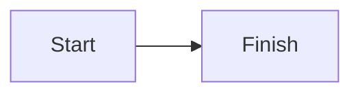
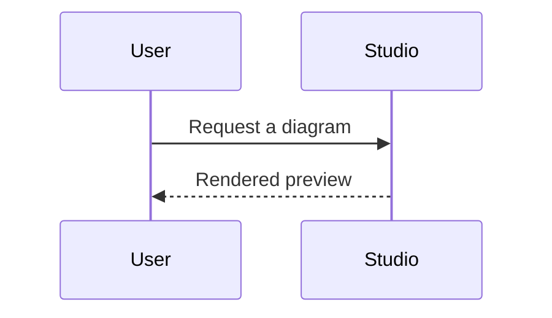
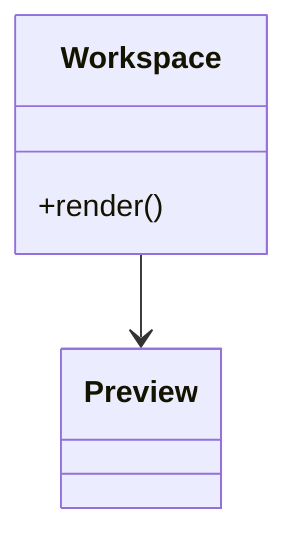
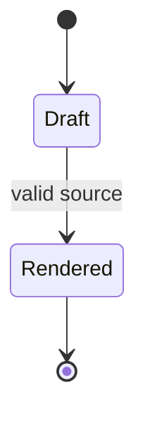
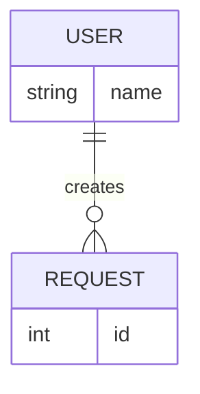
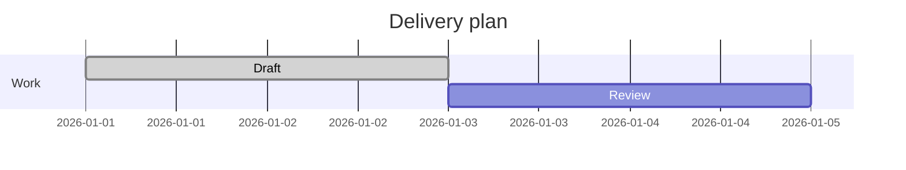

# Mermaid Studio

## Source contract

The workspace renders with the repository's pinned `mermaid@11.17.2` package. Produce source for that renderer, rather than relying on a Mermaid feature from another version. Keep the first line as one of the supported diagram declarations below, then use the matching syntax throughout the source:













Use plain ASCII identifiers, quote labels only when the diagram grammar requires it, and put one statement per line. Prefer `flowchart` for ordinary nodes and edges. Do not invent a declaration, mix diagram grammars, or add Markdown fences to the `.mmd` file. For labels containing punctuation, use a node label such as `A["Retry: 2 times"]`; keep edge text short. Keep examples small enough to diagnose when a render fails.

## Render and repair loop

After every agent update, read the current revision and write the complete replacement source with that revision. Wait for the preview status to settle. A successful render reports `Workspace rendered.` or `Workspace saved and rendered.`. If the status begins `Unable to render workspace:`, read the exact status text, correct only the invalid source, and retry from the latest revision. Preserve the user's edits: if the updater reports a revision conflict, re-read `/source`, compare the current source with the requested change, and ask before replacing a newer human edit. Do not keep retrying unchanged invalid source.

When a user gives a natural-language prompt, choose one diagram type, write the smallest valid source that answers it, render it, and then refine labels or relationships in a follow-up revision. Keep the source in the selected `.mmd` file so the user can inspect and edit it.

When a user asks for help creating a Mermaid diagram or visualization, choose one explicit local `.mmd` path and launch the bundled local preview with one of:

```sh
node .agents/skills/mermaid-studio/launcher.js --new /absolute/path/workspace.mmd
node .agents/skills/mermaid-studio/launcher.js --file /absolute/path/existing.mmd
```

`--new` creates an empty file using exclusive creation and opens an empty workspace. `--file` opens an existing `.mmd` without changing its bytes and renders its source on initial page load. The launcher requires exactly one absolute local `.mmd` path and rejects missing, ambiguous, or unsafe arguments. It starts a loopback-only server and opens its URL in the default browser. On a new checkout, install dependencies first with `pnpm install` (or the project's documented pnpm runtime) so the pinned Mermaid renderer is available.

After launch, keep using the same selected absolute path for agent edits. Read the current source revision before an update, then include that revision when writing so a newer browser edit is reported as a conflict instead of being overwritten:

```sh
revision=$(node .agents/skills/mermaid-studio/update.js --read /absolute/path/workspace.mmd | node -e "let d=''; process.stdin.on('data', c => d += c); process.stdin.on('end', () => process.stdout.write(JSON.parse(d).revision))")
printf '%s\n' 'flowchart LR' '  A[Start] --> B[Finish]' | node .agents/skills/mermaid-studio/update.js --revision "$revision" /absolute/path/workspace.mmd
```

For multiline user-requested changes, pass the complete source through standard input (for example, a quoted heredoc). Re-read the revision for each update and stop to report a conflict if the expected revision is stale. The updater requires an existing absolute `.mmd` file; it does not choose a file or open a browser tab. Wait briefly for the preview to reflect each write before sending the next update.

The browser also provides a Mermaid source editor on the left and a rendered preview on the right. The user can edit the source directly; changes render immediately and save to the same selected `.mmd` file after a short debounce. Continue using the bundled updater for agent changes, and allow a brief polling interval for the open preview to reflect each write.

Use the `Copy Mermaid source` control beneath the editor to copy the complete active source text to the browser clipboard. The status line reports whether the browser accepted or rejected the copy request.

Use the `Paste Mermaid source` control beneath the editor to read Mermaid text from the browser clipboard, replace the active source, render it, and save it to the selected `.mmd` file. The status line reports an empty clipboard, denied clipboard access, or a revision conflict without discarding the current local text.

The launcher records lifecycle state separately for each selected path. Launching the same existing workspace again checks its loopback `/health` endpoint and reuses the healthy server, while a stale record is discarded and a fresh server is started. To stop a workspace explicitly, run:

```sh
node .agents/skills/mermaid-studio/launcher.js --stop /absolute/path/workspace.mmd
```

The lifecycle record is local to the machine and only reconnects to the selected workspace. Opening the saved URL after a browser restart loads the current source from the selected `.mmd`; separate paths have separate lifecycle records and servers.
